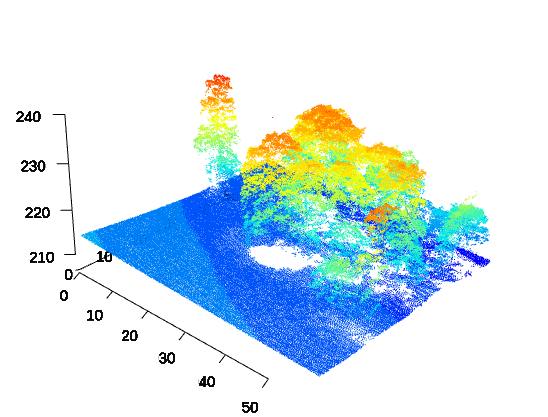

```{r chunks_setup, include = FALSE}
knitr::opts_chunk$set(cache = TRUE,
                      out.width = "100%",
                      collapse = TRUE)
```

```{r hero_image, echo=FALSE}

```

# Introduction {#introduction}

Le programme de couverture nationale en [LiDAR
HD](https://geoservices.ign.fr/lidarhd) de l'IGN est en cours et prévu
sur une diurée de 5 ans. Les données diffusées sont des nuages de points
en 3 dimensions bruts ou classifiés. Plus tard nous auront à disposition
sur la France entière des produits dérivés comme le MNT (modèles
numériques de terrain), le MNS (modèles numériques de surface) et le MNH
(modèles numériques de hauteur). En attendant ces produits IGN, nous
allons voir comment utiliser ces nuages de points avec un package R
nommé lidR.

# Objectifs {#objectifs}

L'objectif de cet article est donc d'explorer cette donnée LiDAR avec le
package R lidR.

-   le LiDAR : qu'est-ce que c'est ?

-   la donnée de l'IGN : quelle est sa spécificité ?

-   le package lidR

-   manipuler un nuage de points : chargement, exploration, traitement,
    visualisaition

# Le LiDAR

Le liDAR est l'acronyme anglais de « Light Detection And Ranging » soit
en français « détection et estimation de la distance par la lumière » ou
« par laser »).

Les nuages de points LiDAR créent des représentations tridimensionnelles
détaillées des objets "scannés". Cette méthode est particulièrement
efficace pour l'étude des arbres et des forêts, permettant aux
scientifiques et aux gestionnaires forestiers de mesurer la hauteur, la
structure et la biomasse des arbres avec une bonne précision. En outre,
les données LiDAR peuvent traverser la canopée pour atteindre le sol,
offrant une vue complète de la structure forestière et aidant à évaluer
l'érosion du sol, la topographie et d'autres caractéristiques
environnementales importantes.

Très concrètement il permet notamment de révéler et d'étudier des
vestiges couverts par la forêt et devient un outils de choix pour
l'archéologie. Voici un exemple qui permet de visualiser les vestiges
archéologiques dissimulés par la forêt sur l'[Îlet à
Guillaume](https://cdn.knightlab.com/libs/juxtapose/latest/embed/index.html?uid=60f2edec-af9a-11ea-a30b-0edaf8f81e27)
à la Réunion.

# La donnée LiDAR de l'IGN

La classification des nuages de points classifiés est décrites dans le
[descriptif de
contenu](https://geoservices.ign.fr/sites/default/files/2023-09/DC_LiDAR_HD_1-0_PTS.pdf).

Les données sont téléchargeables directement sur le site de l'IGN
notamment les [données
brutes](https://geoservices.ign.fr/lidarhd#telechargementclassifiees).

L'ensemble des données LiDAR de l'IGN sont distribuer sous licence
ouverte [Etalab
2.0](https://www.etalab.gouv.fr/licence-ouverte-open-licence/).

Définition des fichiers fournis par l'IGN : LAS file / COPC
<https://en.wikipedia.org/wiki/LAS_file_format>
<https://fr.wikipedia.org/wiki/Octree>

# Package lidR

Le package lidR est permet la manipulation et la visualisation de
données liDAR, plus particulièrement destiné à des applications
forestières. Le package est entièrement open source et est intégré dans
l'écosystème géospatial R incluant les librairies raster / terra / stars
et sp / sf. Il est intéressant de parcourir le [dépôt github
officiel](https://github.com/r-lidar/lidR) du projet ainsi que sa
[documentation](https://r-lidar.github.io/lidRbook/index.html).

`r htmltools::HTML("

Sous Ubuntu des dépendances sont à installer au préalable comme indiqué
sur le dépot GitHub [dépot GitHub
lidR](https://github.com/r-lidar/lidR#install-lidr-dependencies-on-gnulinux)

")`

# Manipuler la donnée LiDAR avec lidR

L'ensemble des manipulations est effectuée avec R dans un document
Rmarkdown permettant ainsi d'être entièrement reproductible. Ainsi dans
Rla suite de l'article toutes les opérations nécessaires à la
manipulation des données sont décrites.

## Initialisation de l'environnement de travail

Afin de démarrer avec un environnement de travail vierge, il est
préférable de supprimer toutes les variables existantes, de libérer la
mémoire utilisée et de ne charger que les librairies de bases.

```{r clear_env, results='hide'}
# Clear existing objects from workspace and free memory
rm(list=ls(all=TRUE)); gc()

# Unload all non-base packages
lapply(names(sessionInfo()$otherPkgs), function(pkgs)
  detach(
    paste0('package:', pkgs),
    character.only = T,
    unload = T,
    force = T
  ))
```

Ensuite définissons le répertoire courant `./` comme le répertoire de
travail.

```{r setwd, results='hide'}
# Set working directory
# setwd(dirname(rstudioapi::getActiveDocumentContext()$path))
```

## Librairies

Chargement des librairies nécessaires à ce tutoriel pour le tratiement
de la données LiDAR, l'affichage des nuages de points, la manipulation
de données et la réalisation de graphiques.

```{r load_libraries, message=FALSE, results='hide'}
library(lidR) # reason of this topic
library(lidRviewer) # large point clouds optimized viewer
library(rgl) # require for 3d plotting
library(leaflet) # for interactive map plot
library(sf) # for spatial vector data manipulation
```

## Charger les données liDAR

### Dossier contenant les données

```{r set_datadir, echo=FALSE}
data_dir <- "/home/ubuntu/Documents/TRAVAIL_cle/data/mnc_lidar/lidar"
```

```{r set_datadir_fake, eval=FALSE}
data_dir <- "/path/to/directory/"
```

### Définition du chemein d'accès du fichier LAS

Pour cet article nous allons utiliser une dalle LiDAR située vers
Fontaines-Saint-Martin.

```{r las_file_name}
lasfile <- paste(data_dir, "LHD_FXX_0843_6529_PTS_O_LAMB93_IGN69.copc.laz", sep = "/")
```

Un fichier LAS ou LAZ contient les coordonnées X, Y et Z de chaque point
du nuage de points ainsi que plusieurs attributs définis par les
[spécifications de
l'ASPRS](https://www.asprs.org/wp-content/uploads/2019/07/LAS_1_4_r15.pdf)
comme par exemple l'intensité de l'écho et le nombre de retours. Afin de
lire ce fichier utilsons la fonction `readLAS` :

```{r load_las_file, cache.lazy = FALSE}
las <- readLAS(lasfile)
```

## Informations générales sur le fichier LAS

Afin de lire les informations générales du fichier LAS chargé, il suffit
d'éxécuter le nom de la variable. Ainsi sont précisées notamment le type
de fichier, l'espace mémoire utilisé, le CRS et la densité de points par
m².

```{r print_summary_information}
las
```

Ce fichier `copc.laz` d'une taille de 170 Mo ainsi chargé dans R occupe
un espace mémoire de 1,8 Go.

```{r print_more_information}
summary(las)
```

Je ne vais détailler l'ensemble des informations du fichier mais ce que
nous pouvons noter est que pour une emprise spatiale de 1 km2 nous avons
plus de 20 millions de points soit une densité de points supérieure à 20
points / m2.

### Attributs pour chaque points

Il est possible de voir quels attributs il renferme avec la fonction
`summary` :

--> ref vers la specification
<https://geoservices.ign.fr/sites/default/files/2022-05/DT_LiDAR_HD_1-0.pdf>

```{r print_points_attributs}
names(las)
```

Il est intéressant de comparer cette données LiDAR IGN à la données
Sentinel-2 en terme de volume de données, afin d'avoir une idée de
l'ordre de grandeur des traitements qui vont suivre.

|                       | Sentinel-2             | Lidar HD IGN            |
|-----------------------|------------------------|-------------------------|
| Densité brute         | 1 pixel / 10m^2       | 20 points / m^2        |
| Nombre daAttributs    | 12 (bandes)            | 22                      |
| Densité d'information | 1,2 information / m^2 | 440 informations / m^2 |

Il faut noter que l'IGN mentionne une densité de points au m^2 moyenne
de 10.

Pour les bandes Sentinel-2 le calcul est fait en focntion des bandes à
10m de résolution spatiale

|                    | Sentinel-2 | Lidar HD IGN |
|--------------------|------------|--------------|
| Empreinte spatiale | 110 km^2  | 1 km^2      |
| Taille fichier     | 2,2 GB     | 170 MB       |
| MB / km^2         | 22         | 170          |

Tout ça pour dire que la données LiDAR est une donnée très dense
(environ 10 fois plus que Sentinel-2) et afin d'en utiliser que ce qui
nous intéresse pour un traitement, le package lidR mis en place
plusieurs solutions.

### Réduire la taille du fichier chargé

La fonction `readLAS` intègre un paramètre `select` qui permet de
sélectionner les attributs que l'on souhaite charger, reduisant ainsi
considéralement la mémoire système utilisée. Dans l'exemple suivant, on
réduit l'espace mémoire utilisé de 2,3 GB à 600 MB en chargeant
uniquement les coordonnées des points et l'attribut de classification.

```{r compare_load_options_memory_size, cache.lazy = FALSE}
readLAS(lasfile) %>% object.size() %>% print(units = "Mb", standard = "SI")
readLAS(lasfile, select = "xyzc") %>% object.size() %>% print(units = "Mb", standard = "SI")
```

Pour la suite, nous allons donc la taille de notre fichier las en selectionnant uniquement les attributs xyz et la classification.

```{r reload_las_file}
las <- readLAS(lasfile, select = 'xyzc')
```

### Optimisation avancée

Afin d'optimiser l'utilisation de la mémoire il faut utiliser le
[LAScatalog processing
engine](https://cran.r-project.org/web/packages/lidR/vignettes/lidR-LAScatalog-engine.html)
qui est une utilisation avancée du package lidR.

## Système de coordonnées de référence ou CRS


Le Système de Coordonnées de Référence (SCR)
Il existe deux types de de SCR : les SCR projetés (ou cartésiennes) et les SCR géographiques. Les SCR géographiques utilisent la latitude et longitude qui s'expriment en degrés pour définir un point à la surface de la Terre.


```{r crs}
st_crs(las)$Name
st_crs(las)$epsg
```

Des inforamtions plus détaillées sur le CRS peuvent être affichées avec
la commande suivante :

```{r WktPretty}
writeLines(st_crs(las)$WktPretty)
```

## Récupérer l'emprise spatiale du fichier chargé

En effet nous avons téléchargé et charger dans une variable le nuage de
points. Il est intéressant à ce stade de s'assurer d'avoir utilisé le
bon fichier. Il faut donc récupérer l'étendue du nuage de points et
l'afficher. Pour l'afficher la librairie `leaflet` fera l'affaire.

L'emprise spatiale est récupérée dans un objet sfc avec la fonction
`st_bbox` du package `sf`. Il ne faut pas oublier de lui spécifier le
Système de Coordonnées de Référence.

`Leaflet` gère de façon complexe les systèmes de projections. Ce qu'il
faut retenir est qu'il a besoin de coordonnées latitude / longitude et
qu'il fait sa tambouille avec. Pour mieux comprendre ce ]fil de
discussion](<https://gis.stackexchange.com/questions/310091/what-does-the-default-crs-being-epsg3857-in-leaflet-mean>)
sur [gis.stackexchange.com](gis.stackexchange.com) est intéressant.

```{r las_bbox}
bbox_2154 <- st_bbox(c(xmin = las@header$`Min X`,
                       xmax = las@header$`Max X`,
                       ymax = las@header$`Max Y`,
                       ymin = las@header$`Min Y`),
                     crs = st_crs(las)) %>%
  st_as_sfc()

bbox_4326 <- st_transform(bbox_2154, 4326)
bbox_4326
```

```{r las_bbox_on_map}
leaflet() %>%
  setView(lng = st_centroid(bbox_4326)[[1]][1],
          lat = st_centroid(bbox_4326)[[1]][2],
          zoom = 14) %>%
  addTiles() %>%
  addPolygons(data = bbox_4326)
```

# Réduction de la densité du nuage de points

Fonction decimate_points avec random(5) va réduire la densité de points
au m2 à 5.

```{r decimate_points}
las %>%
  object.size() %>%
  print(units = "Mb", standard = "SI")

las_d5 <- las %>%
  decimate_points(random(5)) %>%
  object.size() %>%
  print(units = "Mb", standard = "SI")

las_d1 <- las %>%
  decimate_points(random(1)) %>%
  object.size() %>%
  print(units = "Mb", standard = "SI")

las_d0.1 <- las %>%
  decimate_points(random(0.1)) %>%
  object.size() %>%
  print(units = "Mb", standard = "SI")
```

--> comparer avec le nuage de points initial. Combien de différence...
est-ce suffisant pour le but visé ? taille de fichier

# Visualisation du nuage de points

```{r plot_las}
las_d0.1 <- las %>% decimate_points(random(0.1))
if (all(c('R', 'G', 'B') %in% names(las_d0.1@data))) {
  plot(las_d0.1, size = 2, bg = "white", color = 'RGB')
  rglwidget()
}
```

# Découpe du nuage de points

Afin de ne conserver que les points de la zone d'intérêt il existe
plusieurs fonctions de découpe du nuage de points.


`clip_circle`

```{r clip_circle}
center_4326 <- st_sfc(st_point(c(4.85326, 45.84448)), crs = 4326)
center_2154 <- st_transform(center_4326, 2154)
las_roi_circle <- clip_circle(las,
                                    xcenter = st_coordinates(center_2154)[[1]],
                                    ycenter = st_coordinates(center_2154)[[2]],
                                    radius = 100)
```

```{r plot_roi_circle_Z}
plot(las_roi_circle %>% decimate_points(random(5)), size = 1, bg = "white", axis = TRUE, legend = TRUE)
rglwidget()
```

`clip_rectangle`

```{r get_rectangle}
centerX = min(las@data$X) + 100
centerY = min(las@data$Y) + 100
roi_extent <- 30 # demi largeur de la zone d'intérêt
```

```{r clip_rectangle}
las_roi_rectangle <- clip_rectangle(las,
                      xleft = centerX - roi_extent,
                      ybottom = centerY - roi_extent,
                      xright = centerX + roi_extent,
                      ytop = centerY + roi_extent)
```


```{r plot_roi_rectangle_Z}
plot(las_roi_rectangle, size = 1, bg = "white", axis = TRUE, legend = TRUE)
rglwidget()
```

```{r plot_roi_rectangle_RGB}
if (all(c('R', 'G', 'B') %in% names(las_roi_rectangle@data))) {
  plot(las_roi_rectangle, size = 2, bg = "white", color = 'RGB')
  rglwidget()
}
```


```{r plot_roi_rectangle_classification}
plot(las_roi_rectangle, size = 2, bg = "white", color = 'Classification')
rglwidget()
```


# Artciles suivants :

-   cross section, mnt, mnh,

-   identification des arbres et segmentation

-   
