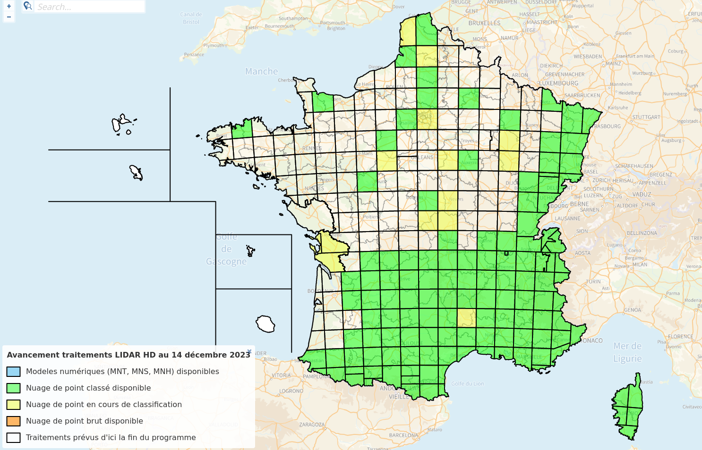

```{r chunks_setup, include=FALSE}
knitr::opts_chunk$set(cache = TRUE,
                      out.width = "100%",
                      collapse = TRUE,
                      message = FALSE,
                      warning = FALSE)
```

```{r hero_image, echo=FALSE}

```

# Introduction {#introduction}

# Objectifs {#objectifs}

-   télécharger les données LiDAR de l'iGN sur la base d'un contour en
    geopackage
-   utiliser les objects LASCatalog du package lidR
-   Utiliser le LAScatalog processing engine pour gérer plusieurs tuiles
    de façon optimisée
-   créer un MNT
-   créer un MNC
-   créer une couche des arbres

# Initialisation de l'environnement de travail

Afin de démarrer avec un environnement de travail vierge, il est
préférable de **supprimer toutes les variables existantes**, de **libérer la
mémoire utilisée** et de ne **charger que les librairies de bases**.

```{r clear_env, results='hide'}
# Clear existing objects from workspace and free memory
rm(list=ls(all=TRUE)); gc()

# Unload all non-base packages
invisible(
  lapply(names(sessionInfo()$otherPkgs), function(pkgs)
    detach(
      paste0('package:', pkgs),
      character.only = T,
      unload = T,
      force = T
    )
  )
)
```

# Chargement des librairies

Chargement des **librairies** nécessaires à ce tutoriel pour le tratiement
de la données LiDAR, l'affichage des nuages de points, la manipulation
de données et la réalisation de graphiques.

```{r load_libraries, message=FALSE, results='hide'}
library(lidR) # to manipulate LiDAR data
library(lidRviewer) # large point clouds optimized viewer
library(sf) # for spatial vector data manipulation
library(dplyr)
library(tmap) # for visualisation
library(maptiles)
library(httr) # for requetting url
library(mapview) # for plot
library(leaflet)
library(terra) # for raster manipulation
```

# Chargement des données

## Dossier contenant les données

```{r set_datadir, echo=FALSE}
data_dir <- "/home/ubuntu/Documents/TRAVAIL_cle/data/mnc_lidar"
```

```{r set_datadir_fake, eval=FALSE}
data_dir <- "/path/to/data/directory/"
```

## Chargement de l'emprise de la commune

Nous allons travailler sur la commune de **Fontaines-Saint-Martin**. Son
emprise spatiale a été récupérée sur le site surlequel le Grand Lyon met
à disposition ses données ouvertes :
<https://data.grandlyon.com/portail/fr/accueil>

Le shapefile contient un polygone de l'emprise de commune avec des attributs qui ne nous seront pas utiles.

```{r boundary_reading}
query <- "Fontaines-Saint-Martin"
boundary_dir <- "metropole-de-lyon"
boundary_file <- "adr_voie_lieu_adrcomgl.shp"
boundary_filepath <- paste(data_dir, boundary_dir, boundary_file, sep = "/")
file_layer <- "adr_voie_lieu_adrcomgl"
fsm <- st_read(dsn = boundary_filepath,
               layer = file_layer,
               quiet = TRUE) %>%
  filter(nom == query)
fsm
```

Visualisons la sélection sur une carte afin de s'assurer de la validité
de la donnée. 

```{r boundary_visualisation}
tmap_mode("view")
tm <- 
  tm_basemap(c(OpenStreetMap = "OpenStreetMap",
               GeoportailFrance.orthos = "GeoportailFrance.orthos",
               OpenTopoMap = "OpenTopoMap")) +
  tm_shape(fsm) +
  tm_polygons(border.col = 'black', lwd = 5, alpha = 0.5);tm
```

## Chargement du tableau d'assemblage des tuiles LiDAR de l'IGN

Nous allons croiser le **tableau d'assemblage** des tuiles LiDAR de l'IGN
avec notre emprise afin de connaitre les références des tuiles à télécharger. Ce
tableau est téléchargeable sur le site
[geoservices.ign.fr](geoservices.ign.fr) à la page des données [LiDAR
HD](https://geoservices.ign.fr/lidarhd#telechargementclassifiees). Un
bouton cliquable *"Télécharger le tableau d\'assemblage en shapefile"* permet de
télécharger un fichier nommé **"grille.zip"**. Une
fois l'archive dézippée la fonction `st_read` du package `sf` permet de lire le shapefile.

```{r lidarIGN_grid}
tilesgrid_dir <- paste(data_dir, "grille", sep = "/")
tilesgrid_file <- "TA_diff_pkk_lidarhd_classe.shp"
tilesgrid_filepath <- paste(tilesgrid_dir, tilesgrid_file, sep = "/")
tilesgrid_layer <- "TA_diff_pkk_lidarhd_classe"
tilesgrid <- st_read(dsn = tilesgrid_filepath,
                     layer = tilesgrid_layer,
                     quiet = TRUE)
```

Le fichier contient un objet géométrique de type `sfc` contenant un polygone.

```{r lidarIGN_grid_content}
head(tilesgrid, n = 1)
```

Le fichier contient deux attributs : le nom de la tuile LiDAR `nom_pkk` et l'url de téléchargement de cette tuile `url_telech`.

```{r lidarIGN_grid_features}
names(tilesgrid)
```

## Reprojection

Les deux données ne sont pas dans le même **Système de Coordonnées
Géographiques**, nous choisissons de reprojeter le contour de la commune
dans l'**EPSG 2154** comme la grille LiDAR.

```{r projection}
fsm <- st_transform(fsm, st_crs(tilesgrid)$epsg)
st_crs(fsm)$epsg == st_crs(tilesgrid)$epsg
```

# Liste des tuiles correspondant à l'emprise de la commune

Cette opération consiste à croiser les géométries des deux données.
Seules les tuiles qui "touchent" l'emprise de la commune nous
intéressent.

Dans un premier temps, afin d'optimiser le tratiement la grille est réduite avant d'effectuer la
jointure car elle composée de **280303 objets**, le nombre de tuiles LiDAR disponibles. Pour cela une simple
découpe `st_crop` de la grille est effectuée avec un buffer `st_buffer` autour du centre de
l'emprise de la commune `st_centroid`.

```{r grille_reduced}
tilesgrid <- st_crop(tilesgrid, st_buffer(st_centroid(fsm), 3000))
```

Ensuite plusieurs solutions sont envisageables. Une première est la
réalisation d'une **jointure spatiale** sur les polygones des deux données
pour lesquels il y a un **"overlaps"**.

```{r st_join}
tiles_sel <- st_join(x = tilesgrid, y = fsm, join = st_overlaps) %>% 
  select(nom_pkk, trigramme) %>% 
  filter(trigramme == 'FSM')
```

Une autre solution est d'ajouter un attributs qui teste l'**overlapping**
entre les polygones et de filtrer au niveau de cet attribut.

```{r st_overlaps}
tiles_sel <- tilesgrid %>% 
  mutate(overlaps = as.integer(st_overlaps(x = tilesgrid, y = fsm))) %>% 
  filter(overlaps == 1)
```

Ce qui nous intéresse ici pour la suite c'est de récupérer la liste des
**urls de téléchargement** des tuiles sélectionnées.

```{r tiles_sel_urls}
urls <- tiles_sel$url_telech
```

Les tuiles à télécharger sont les suivantes :

```{r tiles_url_example}
urls
```

Afin de vérifier la sélection affichons les tuiles sur une carte avec
l'emprise de la commune.

```{r tiles_sel_visualisation}
tmap_mode("view")
tm <- 
  tm_basemap(c(OpenStreetMap = "OpenStreetMap",
               GeoportailFrance.orthos = "GeoportailFrance.orthos",
               OpenTopoMap = "OpenTopoMap")) +
  tm_shape(tiles_sel) +
  tm_polygons(border.col = 'red', alpha = 0.1) +
  tm_shape(fsm) +
  tm_polygons(border.col = 'black', lwd = 5, alpha = 0.5);tm
```

# Téléchargement des tuiles

La fonction suivante permet le téléchargement des tuiles à partir de
leur url ainsi que de les enregistrer dans un dossier défini.

```{r download_function}
download_data <- function(url, dir) {
  lidar_filename <- strsplit(url, split = "/")[[1]][8]
  lidar_filepath <- paste(dir, lidar_filename, sep = "/")
  if(!file.exists(lidar_filepath)) {
    GET(url,
        write_disk(lidar_filepath),
        progress())
  }
}
```

Appliquons la fonction à l'ensemble des urls afin de télécharger ces
tuiles.

```{r download_files, results='hide'}
download_dir <- paste(data_dir, "lidar", sep = "/")
invisible(
  lapply(urls, download_data, dir = download_dir)
)
```

Vérifions que les tuiles ont bien été téléchargées en listant les fichiers du dossier de téléchargement :

```{r downloaded_files}
tiles_name <- list.files(download_dir, pattern = ".copc.laz")
```

# LASCatalog

Afin de gérer un ensemble de fichiers avec un ordinateur classique, le package `lidR` met à disposition un objet `LAScatalog` qui permet d'appliquer des traitements de façon optimisée sur une liste de tuiles sans avoir besoin de les charger entièrement dans la mémoire.

Pour mieux comprendre les possibilités offertes par ces fonctionnalités, il est intéressant de parcourir la documentation du (LAScatalog formal class)[https://cran.r-project.org/web/packages/lidR/vignettes/lidR-LAScatalog-class.html] et du (LAScatalog processing engine)[https://cran.r-project.org/web/packages/lidR/vignettes/lidR-LAScatalog-engine.html]

## Chargement du LASCAtalog

La liste des tuiles LiDAR préalablement téléchargées sont donc chargées dans un objet `LAScatalog` avec la fonction `readLAScatalog`.

```{r LAScatalog_object}
lidar_dir <- download_dir
lidar_dir <- paste(data_dir, "lidar", sep = "/")
ctg <- readLAScatalog(lidar_dir)
```

## Visualisation du LASCAtalog

```{r LAScatalog_object_visu}
plot(ctg, mapview = TRUE, map.type = "GeoportailFrance.orthos")
```

## Informations du LASCAtalog

```{r LAScatalog_object_information}
ctg
```

## Validation du LASCAtalog

```{r LAScatalog_object_checking}
las_check(ctg)
# las_check(ctg, deep = TRUE) # deep checking but important memory cost
```

## Pré-traitements préalables à l'utilisation du LASCatalog

La fonction `readLAS()` permet de selectionner et filtrer les attributs d'un fichier LAS directement à la lecture. Lors du traitement d'une collection de fichiers `LAScatalog`, la fonction `readLAS()` est appelée en interne et il n'est pas possible de modifier ces paramètres. A la place, les options `opt_filter()` et `opt_select()` permettent de propager ces arguments au catalogue. 

`r htmltools::HTML("

Cependant, il y a des options du `LAScatalog` qui ne sont pas supportées par certaines fonctions. Il faut donc vérifier la documentation afin de s'en assurer. Par exemple la fonction [decimate_points()](https://rdrr.io/cran/lidR/man/decimate_points.html) ne supporte pas l'option `select` (`opt_select()`). 

")`

Pour des raisons d'optimisation de la mémoire de traitement mais aussi du temps de calcul, la réduction de la densité du nuage de points est nécessaire mais il faudra donc l'appliquer sur les fichiers `LAS` de manière individuelle si on veut pouvoir filtrer les nuages de points directement à la lecture avec la fonction `readLAS()`.

`r htmltools::HTML("

lidR n'écrit pas de fichiers `copc` donc il faut bien exporter le fichier `.copc.laz` en un fichier `.las`.

")`

Nous allons donc effectuer une réduction de la densité des nuages de points suavr chaque fichier LAS et le catalogue sera créé sur cette base. Une première fonction permet simplement de construire le chemin d'accès du fichier de sortie :

```{r outputname_from_inputname}
outputname_from_inputname <- function(input_filename, tail_name) {
  output_filename <- sub(pattern = "(.*)\\.copc.laz*$", replacement = "\\1", basename(input_filename))
  output_filename_with_tail <- paste(output_filename, tail_name, sep = "_")
  output_dir <- paste(data_dir, results_dir, tail_name, sep = "/")
  if(!dir.exists(output_dir)) dir.create(output_dir)
  output_filepath <- paste(paste(output_dir, output_filename_with_tail, sep = "/"), ".laz", sep = "")
  return(output_filepath)
}
```

La fonction suivante permet de réduire la densité du nuage de points et de l'exporter.

```{r las_decimate_points}
las_decimate_points <- function(input_filename, select_options, filter_options, density, tail_name) {
  output_filepath <- outputname_from_inputname(input_filename, tail_name)
  if(!file.exists(output_filepath)) {
    las <- readLAS(input_filename, select = select_options, filter = filter_options)
    las_decimate <- lidR::decimate_points(las, homogenize(density))
    lidR::writeLAS(las = las_decimate, file = output_filepath)
  }
}
```

Les deux fonctions précédentes sont utilisées pour créer les nuages de points de densité de 10m² qui serviront pour la suite des calculs. Afin de réduire la taille des fichiers, la fonction `readLAS()` sera utilisée avec les deux paramètres `select` et `filter` :
 - les attributs X, Y, Z et la classification sont sélectionnés : `select = "xyzc"`
 - un filtre est réalisé afin de retirer les points avec aucun retour de laser : `filter = "-drop_number_of_returns 0"`
  - un autre filtre est réalisé afin de retirer les points des classes 65 (Artefacts) et 66 (Points virtuels) : `filter = "-drop_extended_class 65 66"`

```{r export_decimated_las}
results_dir <- "outputs"
input_filenames <- list.files(lidar_dir, pattern = ".copc.laz", full.names = TRUE)
tail_name <- "decimated"
select_options <- "xyzc"
filter_options <- "-drop_number_of_returns 0 -drop_class 1 -drop_extended_class 65 66"
density <- 10
invisible(
  lapply(
    X = input_filenames,
    FUN = las_decimate_points,
    select_options = select_options,
    filter_options = filter_options,
    density = density,
    tail_name = tail_name)
)
```

## LASCatalog mis à jour avec les nuages de points optimisés

```{r LAScatalog_object_update}
decimate_dir <- paste(data_dir, results_dir, tail_name, sep = "/")
ctg <- readLAScatalog(decimate_dir)
ctg@data[["filename"]]
```

## Options du "LAScatalog processing engine"

```{r LAScatalog_object_options}
opt_chunk_size(ctg) <- 0 # default 0 is size of tile : 1000 for IGN LiDAR tiles
opt_chunk_buffer(ctg) <- 30 # default is 30
```

## See chunks buffers : default is 30

```{r LAScatalog_object_buffer_visu}
plot(ctg, chunk = TRUE)
```

# Construction du Modèle Numérique de Terrain (MNT ou DTM en anglais)

```{r dtm}
dtm_dir <- paste(data_dir, results_dir, "dtm", sep = "/")
if(!dir.exists(dtm_dir)) dir.create(dtm_dir)
dtm_filepath <- paste(dtm_dir, "dtm_{XLEFT}_{YBOTTOM}", sep = "/")
opt_output_files(ctg) <- dtm_filepath
dtm_resolution <- 1

if(!file.exists(paste(dtm_dir, "rasterize_terrain.vrt", sep = "/"))) {
  dtm <- lidR::rasterize_terrain(ctg, dtm_resolution, tin(), pkg = "terra")
  dtm_cropped <- terra::crop(dtm, fsm, mask = TRUE)
} else {
  dtm <- terra::rast(paste(dtm_dir, "rasterize_terrain.vrt", sep = "/"))
  dtm_cropped <- terra::crop(dtm, fsm, mask = TRUE)
}
plot(dtm_cropped)
```

# Construction du Modèle Numérique de Terrain avec ombrage

```{r dtm_shadded}
dtm_prod <- terra::terrain(dtm_cropped, v = c("slope", "aspect"), unit = "radians")
dtm_hillshade <- terra::shade(slope = dtm_prod$slope, aspect = dtm_prod$aspect)
plot(dtm_hillshade, col = gray(0:50/50), legend = FALSE)
```

# Construction du Modèle Numérique de Canopée (MNC ou CHM en anglais)

## Normalisation de la hauteur des points

```{r ctg_normalize}
normalized_dir <- paste(data_dir, results_dir, "normalized", sep = "/")
if(!dir.exists(normalized_dir)) dir.create(normalized_dir)
normalized_filepath <- paste(normalized_dir, "nlas_{XLEFT}_{YBOTTOM}", sep = "/")
opt_output_files(ctg) <- normalized_filepath
opt_laz_compression(ctg) <- TRUE

if(length(list.files(normalized_dir)) == 0) {
  ctg_normalize <- normalize_height(ctg, tin())
} else {
  ctg_normalize <- readLAScatalog(normalized_dir)
}
```

Les fichiers temporaires suivants on été créés :
  
```{r LAScatalog_object_normalize_files_created}
ctg_normalize@data[["filename"]]
```

```{r check_height_normalization}
# norm <- readLAS(ctg_normalize@data[["filename"]][1])
# norm_ground <- filter_ground(norm)$Z
# hist(norm_ground, breaks = seq(min(norm_ground), max(norm_ground), 0.01), main = "After normalize_height", xlab = "Elevation (m)")
```

# CHM

# selectionner (filter) uniquement la classe des arbres ?

```{r chm}
chm_dir <- paste(data_dir, results_dir, "chm", sep = "/")
if(!dir.exists(chm_dir)) dir.create(chm_dir)
chm_filepath <- paste(chm_dir, "chm_{XLEFT}_{YBOTTOM}", sep = "/")
opt_output_files(ctg_normalize) <- chm_filepath
opt_filter(ctg_normalize) <- "-keep_class 3 4 5"
opt_laz_compression(ctg_normalize) <- TRUE
chm_resolution <- 1

if(!file.exists(paste(chm_dir, "rasterize_canopy.vrt", sep = "/"))) {
  chm <- rasterize_canopy(ctg_normalize, res = chm_resolution, algorithm = p2r())
  chm_cropped <- terra::crop(chm, fsm, mask = TRUE)
} else {
  chm <- terra::rast(paste(chm_dir, "rasterize_canopy.vrt", sep = "/"))
  chm_cropped <- terra::crop(chm, fsm, mask = TRUE)
}

library(RColorBrewer)
col <- height.colors(25)
col <- brewer.pal(n=5, name="Greens")
brewer.pal(n = 8, name = "Dark2")
plot(chm_cropped, col = col)
```
```{r ttops_computing}
opt_output_files(ctg_normalize) <- ""
opt_filter(ctg_normalize) <- "-keep_class 5"
ttops <- locate_trees(ctg_normalize, lmf(12), uniqueness = "bitmerge")
st_write(obj = ttops, dsn = paste(data_dir, results_dir, "ttops.gpkg", sep = "/"))
```


```{r ttops_visu}
# plot(chm, col = height.colors(50))
# plot(sf::st_geometry(ttops), add = TRUE, pch = 3)
```

```{r ttops_visu_tmap}
# tmap_mode("view")
# tm <- 
#   tm_basemap(c(OpenStreetMap = "OpenStreetMap",
#                GeoportailFrance.orthos = "GeoportailFrance.orthos",
#                OpenTopoMap = "OpenTopoMap")) +
#   tm_shape(ttops) +
#   tm_dots(size = 0.3);tm
```

Afin de fusionner les fichiers temporaires las du LASCatalog :

- il existerait une option : opt_merge(ctg) <- TRUE ?  
https://gis.stackexchange.com/questions/434229/save-raster-tiles-created-by-catalog-apply-as-single-file

- une autre option ? singlefile_ctg <- catalog_retile(ctg) ?  
https://gis.stackexchange.com/questions/387630/how-to-filter-heights-using-lascatalog-in-lidr  
https://gis.stackexchange.com/questions/439783/r-lidr-stitching-several-las-files-into-one


# MNC avec seulement les points des classes végétatoins

Les classes végétation sont les trois suivantes :
 - Végétation basse (3) 0-0,50m
 - Végétation moyenne (4) 0,50-1,50m
 - Végétation haute (5) +1,50m

```{r chm_vegetation}
chm345_dir <- paste(data_dir, results_dir, "chm345", sep = "/")
if(!dir.exists(chm345_dir)) dir.create(chm345_dir)
chm345_filepath <- paste(chm345_dir, "chm345_{XLEFT}_{YBOTTOM}", sep = "/")
opt_output_files(ctg_normalize) <- chm345_filepath
opt_laz_compression(ctg_normalize) <- TRUE
chm345_resolution <- 1

if(!file.exists(paste(chm345_dir, "rasterize_canopy.vrt", sep = "/"))) {
  chm345 <- rasterize_canopy(ctg_normalize, res = chm345_resolution, algorithm = p2r())
  chm345_cropped <- terra::crop(chm345, fsm, mask = TRUE)
} else {
  chm345 <- terra::rast(paste(chm345_dir, "rasterize_canopy.vrt", sep = "/"))
  chm345_cropped <- terra::crop(chm345, fsm, mask = TRUE)
}

col <- height.colors(25)
plot(chm345_cropped, col = col)
```


```{r ttops_benchmark_computing}
opt_output_files(ctg_normalize) <- ""
opt_filter(ctg_normalize) <- "-keep_class 5"


ws

ttops <- locate_trees(ctg_normalize, lmf(12), uniqueness = "bitmerge")
st_write(obj = ttops, dsn = paste(data_dir, results_dir, "ttops.gpkg", sep = "/"))
```


